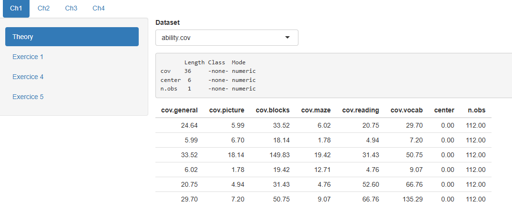

Mastering Shiny Book
================

## Introduction

Following the book [Mastering
Shiny](https://mastering-shiny.org/index.html) and
[rhino](https://www.appsilon.com/rhinoverse/rhino) standards, I’ll test
the book concepts inside a simple app.

## What’s done:

- Section getting started (1, 2, 3, 4).

## TODO:

- Interesting sections, like mastering reactivity (13, 14, 15, 16)
