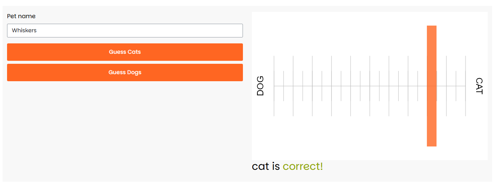

Saturn Cloud Workshop (Jaqueline Nolis)
================

## Introduction

Following the
[workshop](https://github.com/saturncloud/examples/tree/main/examples/workshop-r-shiny-styling),
and using [rhino](https://www.appsilon.com/rhinoverse/rhino) standards,
I want to recreate the app and refresh good practices using bootstrap.

## What’s done:

- Modular coding.
- Styling the app.
- Bootstrap.
- Sass.

## TODO:

- Better modular structure.
- Personal styling.
- Testing.
- Versioning.
- Performance
